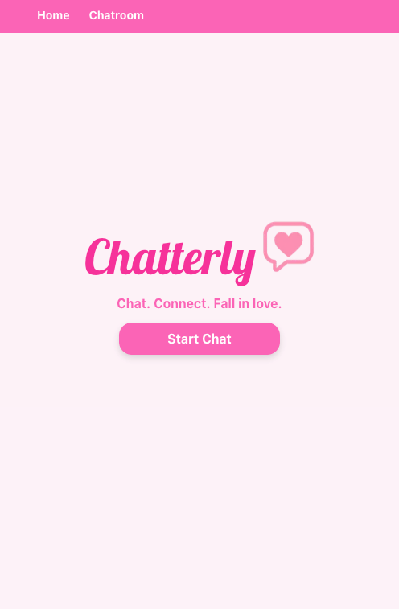
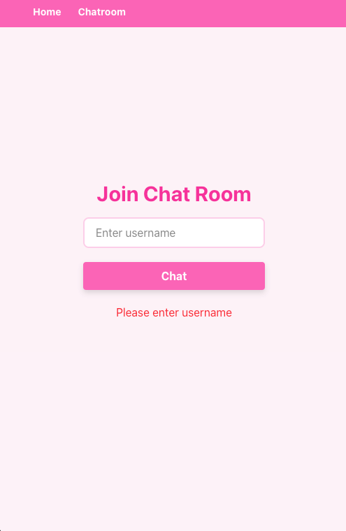
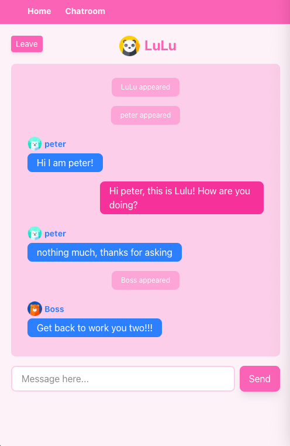

# Next.js Chatroom App



## Live Demo

[https://next-chatroom-t6xk.vercel.app](https://next-chatroom-t6xk.vercel.app)

## Overview

This is a simple chatroom web application built using **Next.js** and **Tailwind CSS**. The project demonstrates the development skills including:

- Component-based architecture
- Props and state management
- Event handling
- Conditional rendering
- Responsive and styled UI
- Socket communication (with [Pusher]('https://pusher.com/'))

## Features Implemented

- Home page with welcome message
- Navigation link to chatroom
- Multiple components (`ChatForm`, `ChatMessage`, etc.)
- Local state management for messages
- Event handling for message input and send
- Conditional rendering based on message list
- Tailwind CSS for styling

## Screenshots

### Home Page with welcome message


### Join Form with validation



### Live chating with mutiple users



## Getting Started

This is a [Next.js](https://nextjs.org) project bootstrapped with [`create-next-app`](https://nextjs.org/docs/app/api-reference/cli/create-next-app).

First, run the development server:

```bash
npm run dev
# or
yarn dev
# or
pnpm dev
# or
bun dev
```

Open [http://localhost:3000](http://localhost:3000) with your browser to see the result.
